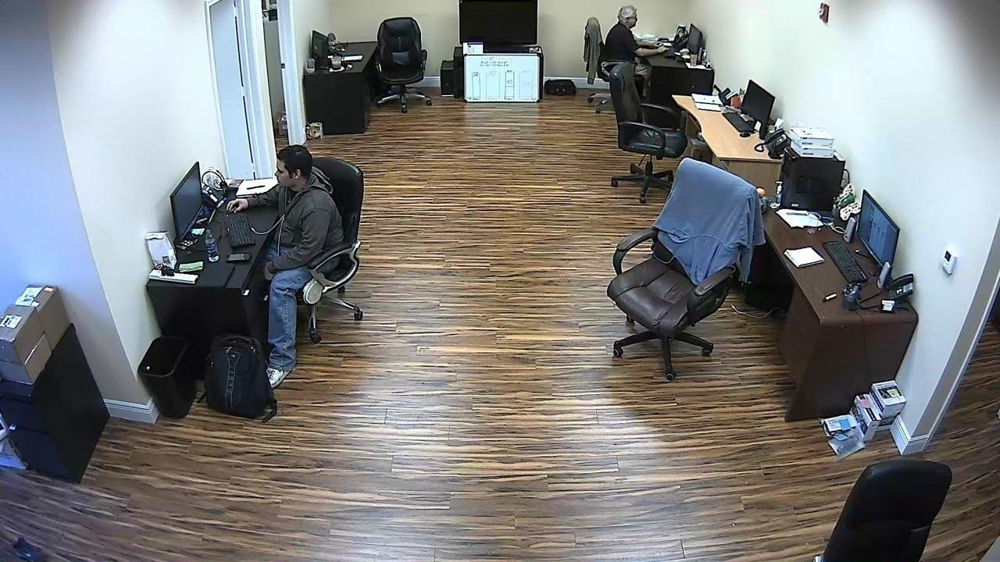

# Smart Office Detection: YOLOv11 + SAHI + Streamlit

This project showcases a full **Smart Office object detection and segmentation** pipeline powered by **YOLOv11** and **Streamlit**, enhanced with **SAHI (Slicing Aided Hyper Inference)** for detecting small and overlapping objects. It provides a clean, interactive web UI for image inference tasks.

---

## Demo (Streamlit WebApp)

> ⚠️ Streamlit Cloud demo link coming soon. Locally, run the app using the instructions below.

---

## Features

* **Object Detection** using YOLOv11 (custom fine-tuned weights)
* **Instance Segmentation** with YOLOv11L-seg model
* **SAHI** slicing support for better detection of small/overlapping objects
* Upload and detect objects in images (videos and streams coming soon)
* Clean, responsive UI with Streamlit

---

## Project Structure

```
smart-office/
├── app.py 
├── helper.py 
├── sahi_helper.py 
├── settings.py 
├──.streamlit
│ └──config.toml
├── weights/
│ ├── yolo11l.pt 
│ └── yolov11l-seg.pt 
├── images/
│ └── temp.jpg 
├── requirements.txt 
└── cv-project-training.ipynb 
```
---

## Installation

> Python 3.10+ is recommended

```bash
# Clone this repository
git clone https://github.com/AzamatMedetbekov/smart-office.git
cd smart-office

# Install dependencies
pip install -r requirements.txt
```

Or manually:

```bash
pip install streamlit opencv-python numpy matplotlib Pillow \
            scikit-image tqdm PyYAML requests scipy \
            sahi ultralytics torch torchvision \
            cvzone filterpy lap hydra-core yt-dlp
```

---

## Model Weights

Place your model weights in the `weights/` directory:

* **Detection**: `weights/yolo11l.pt`
* **Segmentation**: `weights/yolov11l-seg.pt`

If you don’t have weights, train using the steps below or download YOLOv11 models from Ultralytics.

---

## Run the App

```bash
streamlit run app.py
```

---

## Inference Workflow

1. Select Task: Detection or Segmentation
2. Set Confidence threshold (slider)
3. Toggle SAHI for slicing inference
4. Upload Image or use default sample
5. Click 'Detect Objects' to see results

*Only image input is supported in this version.*

---

## Training a Custom Model

We used the dataset [Office Object Detection Dataset](https://www.kaggle.com/datasets/walidguirat/office-object-detection) from Kaggle.

Training was done using YOLOv11L model on this dataset. We used Google Colab with a NVIDIA A100 GPU for training. Refer to the provided notebook cv-project-training.ipynb for full training configuration.

Example training:

```python
from ultralytics import YOLO

model = YOLO('/content/yolo11l.pt')  

model.train(
  data   = '/content/data/dataset.yaml',
  epochs = 20,
  imgsz  = 640,
  batch  = 16,
  workers= 4,
  project= 'runs/train',
  name   = 'office_yolov11'
)
```

Minimal `data.yaml`:

```yaml
train: images/train
val: images/val
nc: 6
names:
- Background
- chair
- dining table
- keyboard
- laptop
- person
```

Make sure label files (`.txt`) have correct class indices.

---

## SAHI Inference (Post-training)

To enhance detection of **small, overlapping, or dense objects**, this project uses a custom `run_sahi_inference`.

### 🔧 Check sahi_helper.py for detailed overview

*SAHI is used after model training to improve detection of small/overlapping objects.*

---

## Screenshots

<table>
  <tr>
    <th>Uploaded Image</th>
    <th>YOLOv11 Detection</th>
    <th>YOLOv11 + SAHI Detection</th>
  </tr>
  <tr>
    <td></td>
    <td></td>
    <td></td>
  </tr>
</table>

---

## requirements.txt

See the provided file. Main packages include:

* `ultralytics>=8.2.0,<12.0.0`
* `sahi>=0.11.14`
* `torch`, `torchvision`
* `streamlit`, `opencv-python`, `matplotlib`, etc.

---

## Tech Stack

* **YOLOv11** by Ultralytics for object detection/segmentation
* **Streamlit** for front-end visualization
* **SAHI** for improved slicing-based inference
* **Kaggle Notebooks** dataset + **Google Colab** for model training 

---

## Notes

* Kaggle Notebooks will stop training when tab/browser closes unless GPU is persistent
* SAHI helps when objects are small, dense, or overlapping
* Segmentation model used: `yolov11l-seg.pt`
